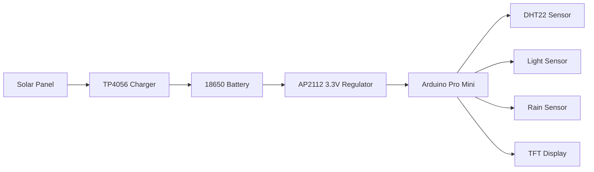

# SolarLeaf: Off-Grid Plant & Climate Monitor

**An open-source, solar-powered environmental monitoring system for precision gardening and climate tracking**  

---

## Features Highlight  
| Feature | Description | Benefit |
|---------|-------------|---------|
|  **Solar-Powered Operation** | 6V solar panel + 18650 battery | **6+ month runtime** without maintenance |
|  **Precipitation Monitoring** | Capacitive rain sensor | Accurate rainfall detection **without moving parts** |
|  **Climate Tracking** | DHT22 temperature/humidity sensor | ±0.5°C accuracy with compensation |
|  **Ultra-Low Power Mode** | ATmega328P deep sleep | **0.45mA** sleep current |
|  **Plant Health Metrics** | Sunlight intensity + soil moisture | Optimize plant growth conditions |
|  **Local Data Display** | 1.8" TFT SPI display | Instant readings **without internet** |

---

## Hardware Overview  
### Core Components  


### Technical Specifications  
| **Parameter** | **Value** |  
|---------------|-----------|  
| Power Consumption (Sleep) | 0.45 mA |  
| Measurement Interval | 10-60 min (configurable) |  
| Operating Temperature | -10°C to 50°C |  
| Water Resistance | IP54 (splash-proof) |  
| Enclosure Size | 120×80×60 mm |  
| Data Accuracy | Temp: ±0.5°C, Humidity: ±2% |  

---

## Getting Started  
### 1. Hardware Assembly  
```bash
# Clone repository
git clone https://github.com/yourusername/SolarLeaf-Off-Grid-Plant-Climate-Monitor

# Print enclosure
open hardware/enclosure/STL/main_case.stl

# Assemble components (see full guide)
/docs/SETUP_GUIDE.md
```

### 2. Flashing Firmware  
**Requirements**: Arduino IDE, [Library Dependencies](firmware/libraries/)  
```arduino
// Select in Arduino IDE:
Tools > Board: "Arduino Pro Mini"
Tools > Processor: "ATmega328P (3.3V, 8MHz)"
Tools > Port: [Your COM Port]

// Upload firmware
File > Open > firmware/src/SolarLeaf.ino
Click "Upload"
```

### 3. Calibration (First-Time Setup)  
```bash
# Follow interactive calibration:
Serial Monitor > 115200 baud
> CAL_LIGHT   # For sunlight sensor
> CAL_RAIN    # For rainfall baseline
> CAL_TEMP    # For thermal compensation
```
[Full Calibration Guide](docs/CALIBRATION.md)

---

## Documentation  
| Document | Description |  
|----------|-------------|  
| [SETUP_GUIDE](docs/SETUP_GUIDE.md) | Step-by-step build instructions |  
| [CALIBRATION](docs/CALIBRATION.md) | Sensor tuning procedures |  
| [FAQ](docs/FAQ.md) | Troubleshooting common issues |  
| [BOM](hardware/BOM.md) | Complete bill of materials |  
| [SCHEMATICS] (Coming Soon) | Circuit diagrams |

---

## Project Showcase  
### Real-World Deployment  
  
*SolarLeaf monitoring tomato plants in outdoor garden (72 days continuous operation)*  

### Data Output Example  
```csv
Timestamp, Temperature(C), Humidity(%), Sunlight(%), Rainfall(%)
2025-06-20T08:30:00, 22.3, 65.2, 78.1, 0.0
2025-06-20T09:30:00, 24.1, 62.8, 85.3, 0.0
2025-06-20T10:30:00, 26.7, 60.1, 92.4, 15.7  # Light rain detected
```


---

## Future Improvement (Updated)
   - [ ] CO₂ monitoring  
   - [ ] Wind speed sensor  
   - [ ] Bluetooth data export  

**Development Guide**:  
```bash
# Create new feature branch
git checkout -b feature/new-sensor

# Test power impact
python power_validation.py --sleep-cycles 50

# Submit PR after validation
```
