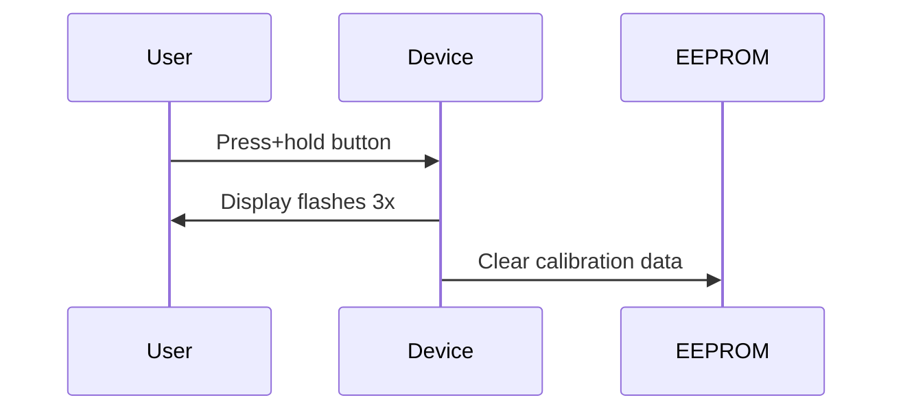

# SolarLeaf FAQ
## Power Issues
### Q: Battery won't charge
- ✅ Check solar panel polarity (diode direction)
- ✅ Test panel output in direct sun (should be >4.5V)
- ✅ Replace TP4056 if red LED doesn't blink

### Q: Device dies after 1 week
- Check deep sleep current (should be <0.5mA)
- Disconnect display, measure again
- Enable serial debug in `power_manager.h`:
  ```cpp
  #define DEBUG_POWER 1
  ```

---

## Sensor Problems
### Q: Rain sensor always shows 100%
- Capacitive sensor short circuit
- Check for water intrusion in cable
- Recalibrate with `CAL_RAIN DRY`

### Q: Temperature readings unstable
- Add 100nF capacitor between DHT22 VCC-GND
- Replace sensor if deviation >2°C
- Avoid mounting near display heat

---

## Display Troubles
### Q: Screen is blank
- Verify backlight voltage (pin 9 HIGH = 3.3V?)
- Check SPI connections (40,38,39,41)
- Adjust LCD initialization delay:
  ```cpp
  // In setup()
  delay(500); // Add after my_lcd.Init_LCD()
  ```

### Q: Graphics are corrupted
- Increase 3.3V regulator capacitance
- Add 10µF capacitor near display VCC
- Reduce SPI speed in library:
  ```cpp
  #define SPI_FREQ 4000000 // Default 8MHz
  ```

---

## Firmware Debugging
### Common Error Messages
| Message                  | Solution                     |
|--------------------------|------------------------------|
| `DHT22 not found`        | Check pull-up resistor       |
| `Rain sensor timeout`    | Reduce sampling frequency    |
| `Low voltage!`           | Charge battery immediately   |

### Factory Reset
Hold button during power-on for 5 seconds:

